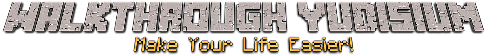

Dokumen ini disusun untuk memudahkan teman-teman dalam mengurus proses yudisium
di FILKOM.

- [Walkthrough Yudisium](walkthrough.md)
- [Panduan Unggah Jurnal](panduan-unggah-jurnal.md)
- [Daftar Kesalahan Umum](kesalahan-umum.md)
- [HowTo dan Rekomendasi Tempat](howto.md)

## Why?

Dokumen ini awalnya disusun oleh Harits Abdurrohman dalam bentuk PDF dan telah menjadi
bagian penting dalam prosesi pengurusan dokumen-dokumen yudisium. Sayangnya,
seiring waktu berlalu, kebijakan terus berubah sehingga kami membuat tempat
terpusat untuk berkolaborasi menyempurnakan dokumen panduan tersebut dari waktu
ke waktu.

Penggunaan media terpusat secara daring membantu melacak perubahan terbaru dengan
baik. Penggunaan PDF menyulitkan pembaca membedakan apakah berkas yang dibaca
merupakan versi terbaru.

## Kontribusi

Tanpa kontribusi, dokumen ini takkan dapat digunakan. Oleh karena itu, bagi
teman-teman yang melihat adanya kekurangan pada bagian apapun, kami harap dapat
berkontribusi pada dokumen ini dengan membuat _pull request_.

Saat membuat _pull request_ silahkan masukkan nama anda dalam berkas [AUTHORS](AUTHORS.md)

Jika ada masalah terkait dokumen ini, jangan ragu untuk membuat _issue_.

### Tidak yakin untuk berkontribusi?

- [How to Use Github](https://guides.github.com/activities/forking/)
- [How to Git from the Command Line](https://rogerdudler.github.io/git-guide/)
- [What is Markdown?](https://github.com/LewisVo/Markdown-Tutorial) - Markdown
  is the writing method used to create this list, if you want to know how to
  format properly, it's best that you learn how to use Github Markdown.
- [Alternative Markdown Guide](https://guides.github.com/features/mastering-markdown/)

## Jaminan (_Warranty_)

Kami tidak menjamin seluruh data pada daftar ini selalu benar dan mutakhir,
mengingat seluruh data ini tidak resmi dan hanya dibuat untuk membantu
memudahkan. Oleh karena itu, kami tidak bertanggung jawab jika ada
ketidakcocokan data. Seluruh data ini ditulis berdasarkan apa yang telah
dilewati oleh [AUTHORS](AUTHORS.md).

## Lisensi

Logo dirancang menggunakan [TextCraft](https://textcraft.net).
