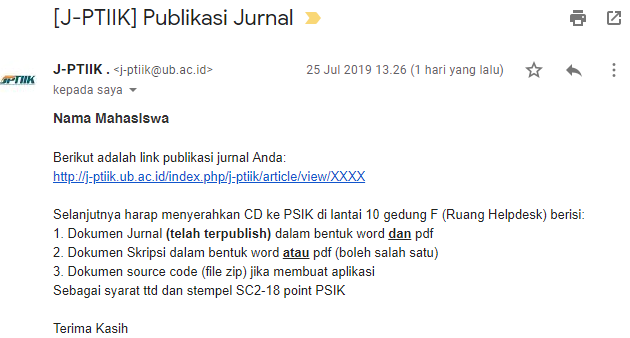

# Panduan Unggah Jurnal

1. Lakukan registrasi
   - isi "afiliasi" dengan: Universitas Brawijaya
   - "apakah anda bersedia mereview" tidak usah dicentang

    

    
    

2. Pilih "naskah baru"

   

   
   

3. Isi bagian ini:
   - Komentar untuk editor tidak perlu di isi

   

   
   

4. Unggah dokumen yang diminta:
   - Dokumen dalam bentuk * **.doc** atau *. **docx** (bukan *.pdf).
   - Siapkan scan SC2-12 dan SC2-17, dan berkas hasil cek plagiasi jurnal dari
     Turnitin (**seluruh berkas, tidak hanya presentase plagiasinya**).
   - Print Pertanyaan Etika Publikasi dan ttd sendiri lalu scan (usahakan
     berformat PDF).
   - Print Perjanjian hak cipta dan ttd sendiri lalu scan (**Perhatikan apa yang
     harus di centang, diskusikan dengan teman anda**) (usahakan berformat PDF).

    Note:
    Ketika proses pengunggahan jurnal, bagian ini tidak perlu diisi. Langsung
    pilih "Lanjutkan"

    

    
    

    Jika tidak ada "kutipan utuh" umumnya yang dicentang adalah:

    

    
    

5. Selanjutnya hanya mengikuti perintah yang tertera seperti menaruh abstak, kata
   kunci, judul bahasa Indonesia dan Inggris

    Note:
    - tinggalkan "daftar penlis" seperti dibawah ini (tidak perlu di
      tambah-tambah)

      

      
      

6. Pemberitahuan dari PSIK (*click to enlarge image*):
   - jika benar
   - jika salah

   Benar                      |  Salah
   :-------------------------:|:-------------------------:
    |  

7. Lanjutkan ke [tahap selanjutnya](walkthrough.md) jika benar, ulangi dari langkah 2 jika salah.

