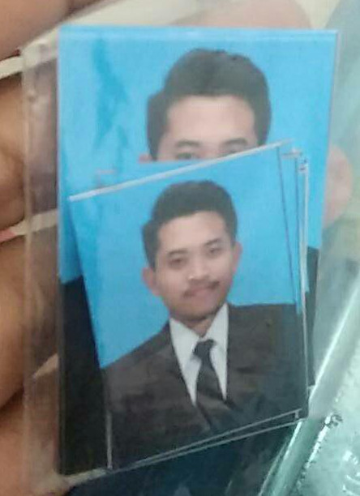
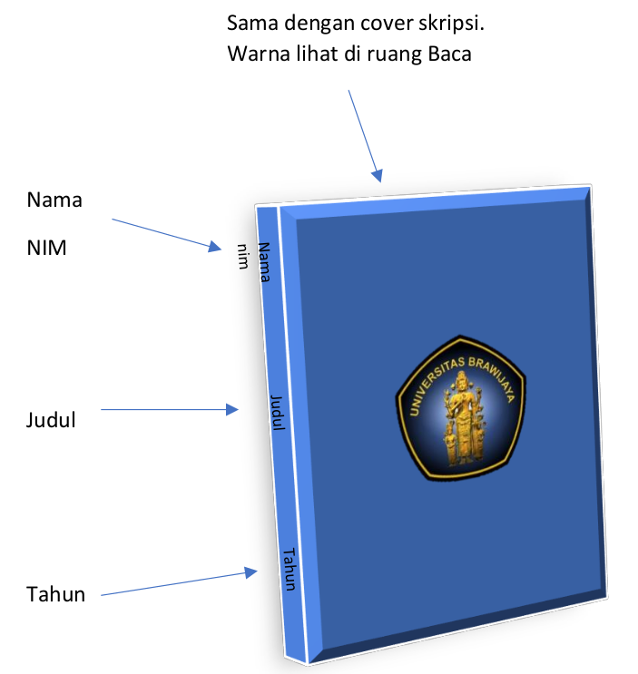
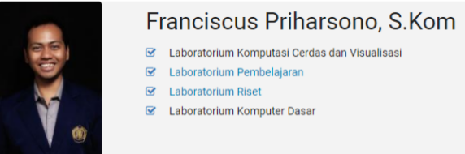
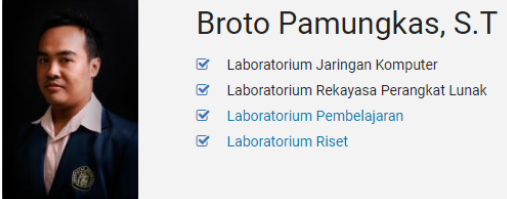
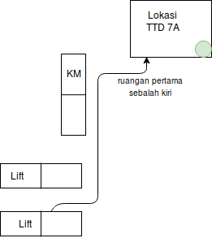
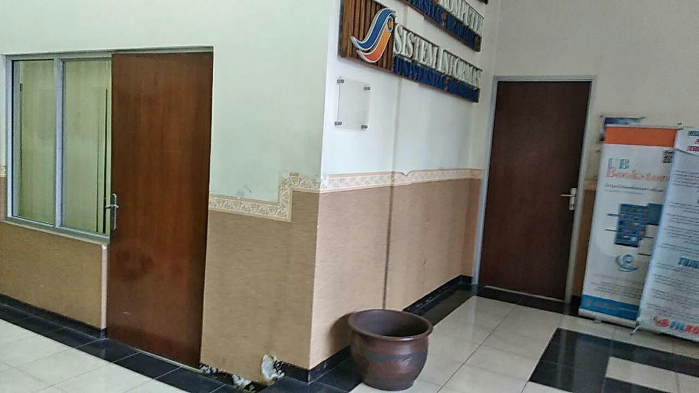
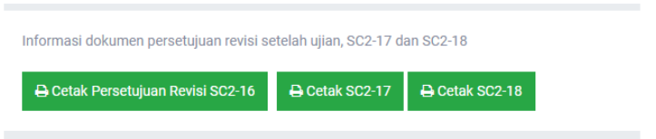
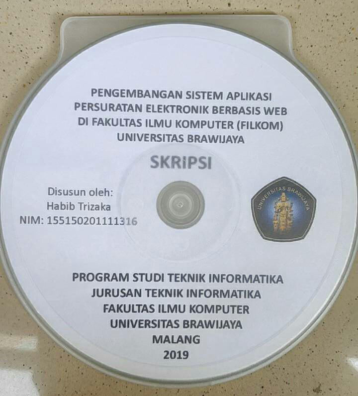
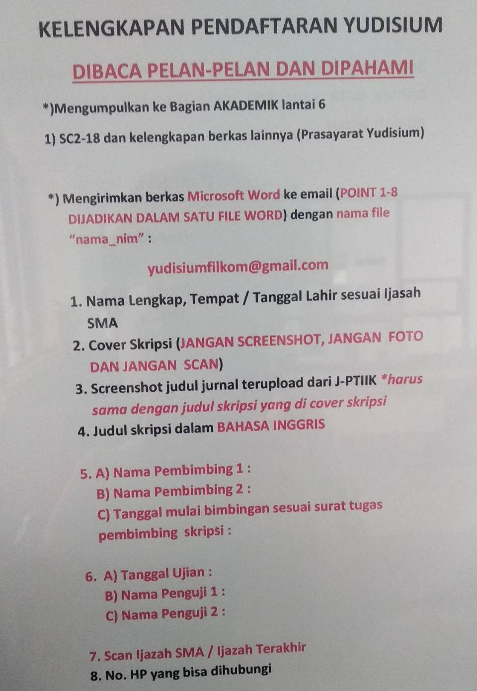

# Walkthrough Yudisium

1. Ambillah foto bersama dosen pembimbing-penguji di ruangan sidang. Setelah
   itu, lakukan foto bersama dengan teman ( _don’t look pathetic, be grateful_ )
   di depan FILKOM, kemudian Fotokopi SC2-12 dan SC2-13 (buat 3 rangkap buat
   jaga-jaga) dan di scan. Jangan lupa ambil KTM setelah selesai menggunakan
   peminjaman kelas.

2. Selesaikan revisi. Jangan ditunda. Foto resmi 3x4 tanpa kacamata dan tanpa
   batas putih disamping foto sebanyak 6 buah + fotokopi KTM dimasukkan ke
   plastik transparan. **Fotokopi ijazah SMA/K yang sudah dilegalisir** dibawa
   dan discan (nanti akan diminta untuk mengunggah).

   Contoh Pas Photo:
   

       
   

3. Jilid dokumen skripsi 5 rangkap + 1 lembar pengesahan & orisinalitas untuk di
   scan. Jilid hardcover warna biru (tidak harus timbul) dengan pembatas per bab
   (tanyakan di tempat print ada pembatas UB atau tidak) dan nama-nim, judul,
   tahun disamping buku.

    

    
    

    Note:
    - 5 rangkap diberikan untuk: 1) dosbing-1 2) dosbing-2 3) perpus UB 4) ruang
      baca FILKOM 5) disimpan sendiri
    - 1 lembar pengesahan (yang senagaja dilebihkan 5 + 1) digunakan untuk
      discan. Lembar pengesahan ini dapat diselipkan pada berkas yang sudah
      dijilid **atau** anda dapat mengabaikan langkah ini dan melakukan scan
      dengan aplikasi scanner pada android kemudian mengubahnya menjadi [A4
      PDF](howto.md#mengganti-gambar-hasil-scanner-ke-a4-pdf)

4. Sambil menunggu jilid, ttd untuk berkas yudisium yang pertama bisa didapat adalah
    poin 7a dan 7b.

    7A                        |  7b
   :-------------------------:|:-------------------------:
    |  

    Lokasi 7A (Ged F lt 10)   |  Lokasi 7b (Ged B)
   :-------------------------:|:-------------------------:
    |  

    Note:
    - Tanyalah pada teman sekitar anda terkait waktu yang tepat untuk menemui
      beliau berdua.

5. Sebelum memberikan skripsi yang telah terjilid ke pak Kajur:
   - pindahkan pita pembatas pada lembar pengesahan
   - tandatangi lembar orisinalitas di atas materai Rp 6 ribu
   - tunjukkan ke akademik lt 1, untuk diberikan paraf tanda bahwa format
    dokumen sudah benar.

6. Letakkan hasil scan orisinalitas dan pengesahan dalam _soft file_ berkas
   skripsi sebelum di unggah.

7. Upload dokumen akhir berisi jurnal, _source code_ bersama naskah
   skripsi ( **Lembar pengesahan dan orisinalitas telah discan ditaruh di
   dokumen** ) di FILKOM APPS. Setelah itu mintalah verifikasi dokumen akhir
   kepada dosbing 1-2.

8. Cetak form perubahan judul dan form unggah makalah di FILKOM APPS di bagian
   info ujian, lalu ke dosbing 1-2 untuk:

   

   
   

   - meminta ttd berkas SC2-16 dan SC2-17. (Kosongkan isi "Judul Skripsi Revisi"
     jika tidak ada revisi pada judul)
   - memberikan berkas jilidan skirpsi, untuk mendapat ttd pada point 3a, 3b,
     4a, dan 4b.

9. Scan SC2-16 dan SC2-17. **keduanya telah  ditandantangi dosen pembimbing 1-2**

10. Daftar di
    [J-PTIIK](http://j-ptiik.ub.ac.id/index.php/j-ptiik/user/register). Kemudian
    lakukan [pengumpulan jurnal](panduan-unggah-jurnal.md). Estimasi pemeriksaan
    1-4 Jam (akhir semester atau sepi) atau 3-4 hari kerja (hari biasa). Hindari
    [kesalahan umum pengumpulan jurnal](kesalahan-umum.md#mengumpulkan-jurnal)
    yang sering terjadi.

11. Sambil menunggu PSIK, burn CD untuk ke Perpustakaan, dalam format berikut:
    - nama lengkap mahasiswa - skripsi.pdf (satu berkas penuh, jangan di pecah perbab)
    - nama lengkap mahasiswa - abstrak.pdf (inggris dan indoesia)

    bentuk cover CD:

    

    
    

    Note:
    - Anda bisa mencetak cover CD diantaranya di [tempat berikut](howto.md#rekomendasi-tempat)
    - Tidak ada ketententuan nama volume CD, tetapi sebaiknya gantilah nama
      volume CD ke nama anda. e.g "Data 01-01-2019" -> "Ibnu Musa".

12. Pergilah ke perpustakaan UB dengan membawa berkas jilidan skirpsi, CD yang
    berisi berkas diatas, dan uang Rp 50 ribu untuk biaya bebas tanggungan.

13. Jika jurnal telah ter-_publish_. Pergilah membawa CD yang berisi berkas
    sesuai format pada surel yang dikirim PSIK. Jangan lupa membawa form SC2-18
    untuk di ttd.

    Note:
    - PDF jurnal didapatkan dengan mengunduh jurnal yang terpublish di jptiik,
      sedangkan docx dari jurnal didapatkan dengan mengubah docx yang sebelumnya
      di _submit_ dengan **mengubah halaman dan tata letak** agar sesuai dengan PDF
      jurnal yang terpublish

14. Berikan dokumen terjilid untuk diberikan ke ruang baca FILKOM, beserta CD
    dengan format yang sama seperti format [CD PSIK](panduan-unggah-jurnal.md).
    Jangan lupa membawa form SC2-18 untuk di ttd.

15. Ke akademik lt 1 untuk:
    - centang poin 2 bebas tanggungan revisi dkk dengan bawa fotokopi SC2-13,
      SC2-16, dan SC2-17.
    - Minta memo ke Wakil Dekan I, lantai 7 (jika diminta) kemudian ke
      Sekretaris Jurusan Lantai 5 (bila diminta)

17. Kirim berkas yudisium dengan format berikut. Subjek email bebas, tidak ada
    ketentuan. (*click to enlarge image*):

    

    
    

18. Ke lantai 6 bagian akademik untuk daftar yudisium, dengan membawa Pas Photo
    dan FC Ijazah (yang didapatkan dari langkah 2). Selanjutnya:
    - Diberi paraf untuk point 9 dan 10
    - Meminta ttd ke seketaris jusuran (Pak Furqan)
    - Mengembalikan berkas SC2-18 yang telah di ttd sekjur ke lt 6. Menunggu
      hingga dibuatkan transkrip (umumnya satu hari). Lalu FC transkrip dan form
      SC2-18 yang telah di ttd kasubag akademik (yang asli diberkan kembali ke
      bagian akademik). Tunggu informasinya di [Twitter FILKOM](https://twitter.com/filkomUB).

      Note:
      - Pas photo dan KTM dimasukkan dalam plastik berklip. Plastik klip
        yang muat untuk KTM (tidak terlalu besar dan tidak terlalu kecil) dapat di
        dapatkan [tempat berikut](howto.md#rekomendasi-tempat).
      - Ketika diberikan transkrip dalam bentuk draft oleh akademik (sebelum
        diminta fc), silahkan cek:
            - nama & tangggal lahir.
            - judul bahasa inggris & bahasa indonesia.
            - cek (total nilai / jumlah sks) apakah telah sesuai dengan IPK yang terteta.

19. _Refreshing!_ 🎉

TIPS: **Selesain yang bisa dikejar di hari itu juga. Estimasi ± seminggu**

